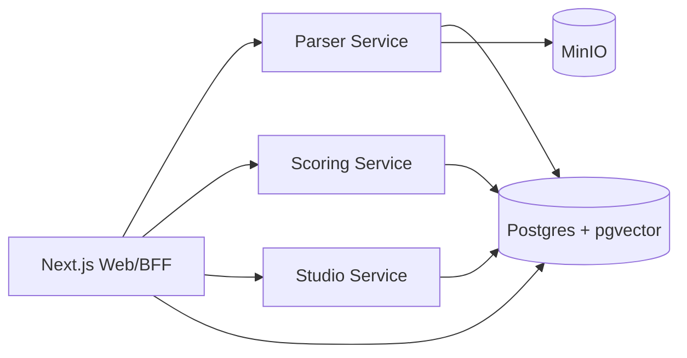

# Company Dossier Scoring

An open-source BYOD (Bring Your Own Documents) company dossier scoring system.

Upload company documents, parse them into an evidence-backed knowledge base, generate scorecards with fixed review templates, and ask dossier-scoped questions with citation guardrails.

## Features

- Document upload and parsing for TXT, PDF, DOCX, and XLSX.
- Evidence chunks stored with `file_id`, `chunk_id`, `page_number`, `snippet`, and `trust_tier`.
- Four built-in scorecard templates:
  - Investment due diligence
  - Credit assessment
  - ESG review
  - Compliance review
- Scorecard versioning and re-scoring after trust changes.
- Dossier-scoped Studio Q&A with citation/refusal guardrails.
- Model API settings page for DeepSeek or any OpenAI-compatible endpoint.
- Local stack with Next.js, FastAPI, Postgres + pgvector, Redis, and MinIO.

## Architecture



## Quick Start

```bash
cp .env.example .env
docker compose -f infra/docker-compose.yml up --build -d
```

Open:

- Web app: <http://localhost:3000/dossiers>
- New dossier: <http://localhost:3000/dossiers/new>
- Model API settings: <http://localhost:3000/settings>

## Model API Settings

The app supports:

- DeepSeek: default `https://api.deepseek.com/v1` and `deepseek-chat`.
- Custom OpenAI-compatible API: any endpoint that supports `/chat/completions`.

API keys are stored in the local `model_settings` table. Do not commit real keys.

## Development Checks

```bash
pnpm --filter web typecheck
pnpm --filter web lint
pnpm --filter web test

cd services/parser && PYTHONPATH=. uv run pytest -q
cd ../scoring && PYTHONPATH=. uv run pytest -q
cd ../studio && PYTHONPATH=. uv run pytest -q
```

## Demo E2E

With Docker services running:

```bash
pnpm demo:e2e
```

The demo creates a company dossier, uploads a TXT file, runs parsing/scoring, asks Studio a cited question, marks the file untrusted, and verifies scorecard version increment.

## OCR

The default parser does not install PaddleOCR because it is a heavy dependency. Optional OCR verification files are included:

- `tools/ocr/README.md`
- `tools/ocr/verify_paddleocr.py`
- `infra/ocr/Dockerfile.example`

## Security

This repository includes local development defaults and `.env.example` placeholders only. Never commit real API keys, production database URLs, or uploaded documents.

## License

MIT
